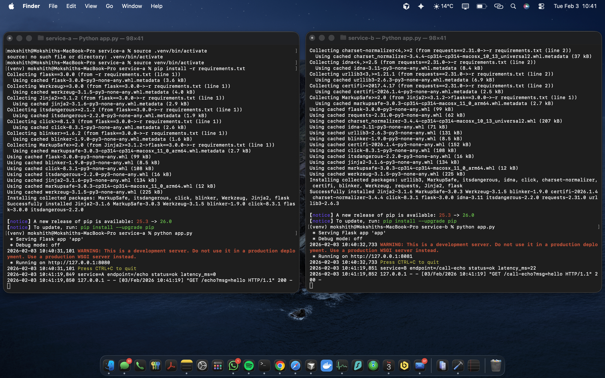
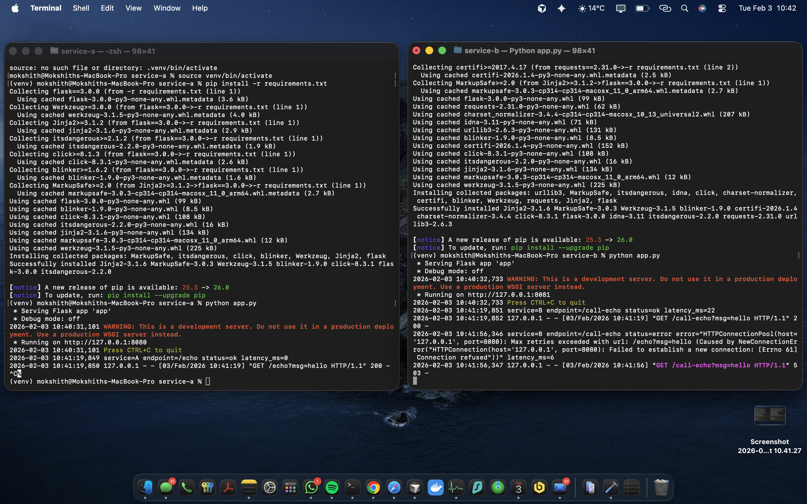
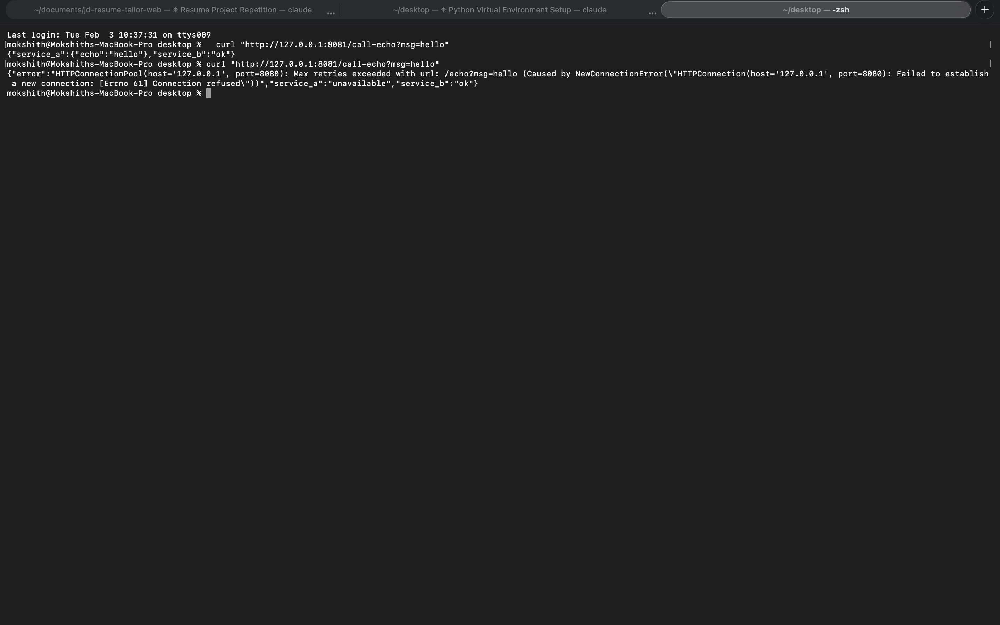

# CMPE 273 – Week 1 Lab 1: Your First Distributed System

Two-service distributed system using Python (Flask + requests).

- **Service A** (Echo API) — `localhost:8080`
- **Service B** (Client) — `localhost:8081`, calls Service A with a 1-second timeout

## How to Run Locally

You need **two separate terminals**.

**Terminal 1 — Service A (port 8080):**
```bash
cd service-a
python3 -m venv venv
source venv/bin/activate
pip install -r requirements.txt
python app.py
```

**Terminal 2 — Service B (port 8081):**
```bash
cd service-b
python3 -m venv venv
source venv/bin/activate
pip install -r requirements.txt
python app.py
```

## Screenshots

### Both Services Running

Service A (port 8080) and Service B (port 8081) running side by side:



### Service A Stopped (Failure Scenario)

Service A stopped with Ctrl+C — Service B handles the failure gracefully:



### Curl Test Results

Success response (both services up) and failure response (Service A down):



## Test Results

### Success (both services running)

```
$ curl "http://127.0.0.1:8081/call-echo?msg=hello"
{"service_a":{"echo":"hello"},"service_b":"ok"}
```

HTTP Status: **200**

Service B log:
```
2026-02-03 06:28:34,179 service=B endpoint=/call-echo status=ok latency_ms=16
```

### Failure (Service A stopped with Ctrl+C)

```
$ curl "http://127.0.0.1:8081/call-echo?msg=hello"
{"error":"HTTPConnectionPool(host='127.0.0.1', port=8080): Max retries exceeded with url: /echo?msg=hello (Caused by NewConnectionError(...: Connection refused))","service_a":"unavailable","service_b":"ok"}
```

HTTP Status: **503**

Service B log:
```
2026-02-03 06:28:39,978 service=B endpoint=/call-echo status=error error="...Connection refused" latency_ms=7
```

## What Makes This Distributed?

This system is distributed because it consists of two independent processes (Service A and Service B) that communicate over the network using HTTP, each running on its own port. Neither service shares memory or state with the other they can be started, stopped, and fail independently. When Service A goes down, Service B continues to run and handles the failure gracefully by returning a 503 status code.
 This demonstrates key distributed systems properties: network communication, independent failure modes, and the need for timeout handling, since Service B cannot assume Service A will always be available or respond promptly.
